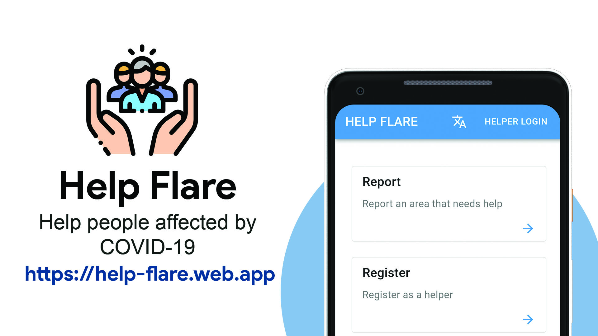

# Help Flare API



### About
During the 2020 COVID-19 pandemic lockdown in India, good Samaritans and NGOs stepped up to help under-privileged localities with basic needs like food, water, sanitation, etc.

To help their efforts, I along with  and  created an app that used Geo-fencing technology to highlight communities that were in need.

### Routes

<details>
    <summary><b>POST /helper</b></summary>

    Query Params: none
    FormData:
        - group_name
        - representative
        - phone
        - password
        - locality (object of lat,lng and place)
        - social_service (optional: Should be stringified array)

    Registeration of social service groups/NGOs

</details>

<details>
    <summary><b>POST /helper/verify</b></summary>

    Query Params: none
    FormData:
        - otp

    Verify OTP

</details>

<details>
    <summary><b>POST /login</b></summary>

    Query Params: none
    FormData:
        - phone
        - password

    Sign in of social service groups/NGOs

</details>

<details>
    <summary><b>POST /report_help</b></summary>

    Query Params: none
    FormData:
        - area_coordinates https://ibb.co/SsVvZYt
        - reported_by (name)
        - phone
        - place (short version of area_coordinates)
        - helpType (description of help needed, should be a stringified array)

    Note: The `area_coordinates` property contains the lat lng of every point of the polygon. Make sure all the coordinates are of `Double` type

    Report a help

</details>

<details><summary><b>Get helps in real time</b></summary>
<p>

1. Initialize socket on the client

```javascript
let socket = io("https://covid-project-api.herokuapp.com/");
```

2. On getting the location of the device from the browser, emit an event to get new helps

```javascript
socket.emit("new_help", { lat: pos.lat, lng: pos.lng });
```

3. After submission of a new help, again emit an event for getting new helps

```javascript
socket.emit("new_help", { lat: pos.lat, lng: pos.lng });
```

4. Listen for new helps to be displayed onto the Google map

```javascript
socket.on("helps", (data) => {
  console.log(data);
  // => Report objects are received
});
```

</p>
</details>

<details>
    <summary><b>POST /help</b></summary>

    Query Params:
        - helpId

    Authorization: Bearer <token>
    FormData: none

    Assign the help to the logged in helper

</details>

<details>
    <summary><b>POST /help/cancel</b></summary>

    Query Params:
        - helpId

    Authorization: Bearer <token>
    FormData: none

    Cancel the claim

</details>

<details>
    <summary><b>POST /help/verify</b></summary>

    Query Params:
        - helpId

    Authorization: Bearer <token>
    FormData:
        - photo (clicked by the camera)

    Verify delivery of help

</details>

<details>
    <summary><b>GET /profile</b></summary>

    Query Params: none
    Authorization: Bearer <token>
    FormData: none

    Profile of the helper

</details>
